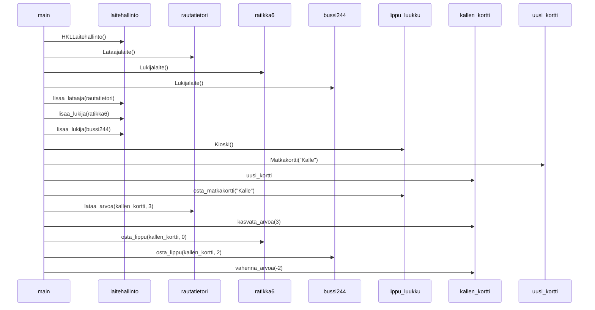

```mermaid
sequenceDiagram
  participant main
  participant laitehallinto
  participant rautatietori
  participant ratikka6
  participant bussi244
  participant lippu_luukku
  participant kallen_kortti
  participant uusi_kortti
  main->>laitehallinto: HKLLaitehallinto()
  main->>rautatietori: Lataajalaite()
  main->>ratikka6: Lukijalaite()
  main->>bussi244: Lukijalaite()
  main->>laitehallinto: lisaa_lataaja(rautatietori)
  main->>laitehallinto: lisaa_lukija(ratikka6)
  main->>laitehallinto: lisaa_lukija(bussi244)
  main->>lippu_luukku: Kioski()
  main->>uusi_kortti: Matkakortti("Kalle")
  main->>kallen_kortti: uusi_kortti
  main->>lippu_luukku: osta_matkakortti("Kalle")
  main->>rautatietori: lataa_arvoa(kallen_kortti, 3)
  main->>kallen_kortti: kasvata_arvoa(3)
  main->>ratikka6: osta_lippu(kallen_kortti, 0)
  main->>bussi244: osta_lippu(kallen_kortti, 2)
  main->>kallen_kortti: vahenna_arvoa(-2)
```
