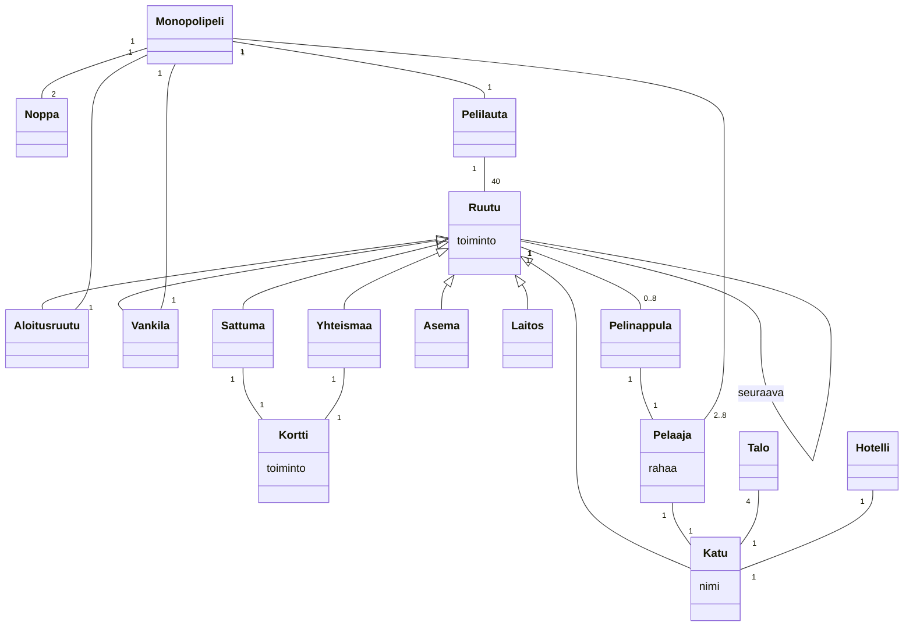

## Monopoli, alustava luokkakaavio

```mermaid
 classDiagram
    Monopolipeli "1" -- "2" Noppa
    Monopolipeli "1" -- "1" Pelilauta

    class Ruutu {
        toiminto
    }

    Ruutu <|-- Aloitusruutu
    Ruutu <|-- Vankila
    Ruutu <|-- Sattuma
    Ruutu <|-- Yhteismaa
    Ruutu <|-- Asema
    Ruutu <|-- Laitos
    Ruutu <|-- Katu

    Aloitusruutu "1" -- "1" Monopolipeli
    Vankila "1" -- "1" Monopolipeli

    Sattuma "1" -- "1" Kortti
    Yhteismaa "1" -- "1" Kortti

    class Kortti {
        toiminto
    }

    class Katu {
        nimi
    }

    Pelilauta "1" -- "40" Ruutu
    Ruutu "1" -- "1" Ruutu : seuraava
    Ruutu "1" -- "0..8" Pelinappula
    Pelinappula "1" -- "1" Pelaaja
    Pelaaja "2..8" -- "1" Monopolipeli

    class Pelaaja {
        rahaa
    }

    Pelaaja "1" -- "1" Katu
    Talo "4" -- "1" Katu
    Hotelli "1" -- "1" Katu
```
