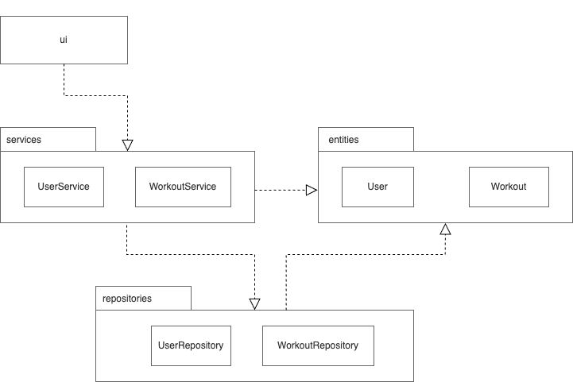
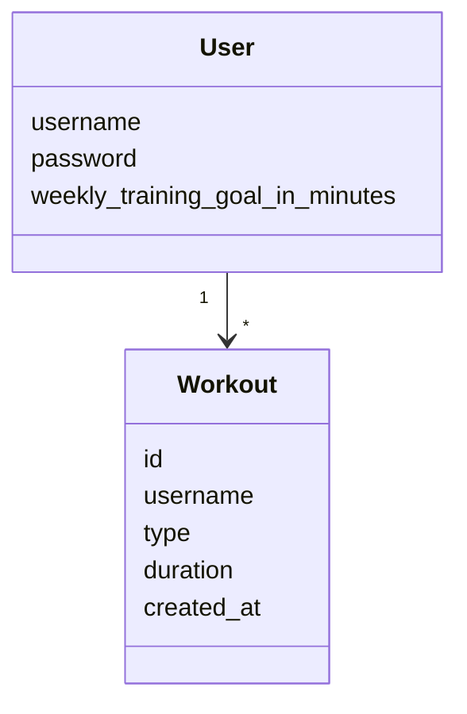
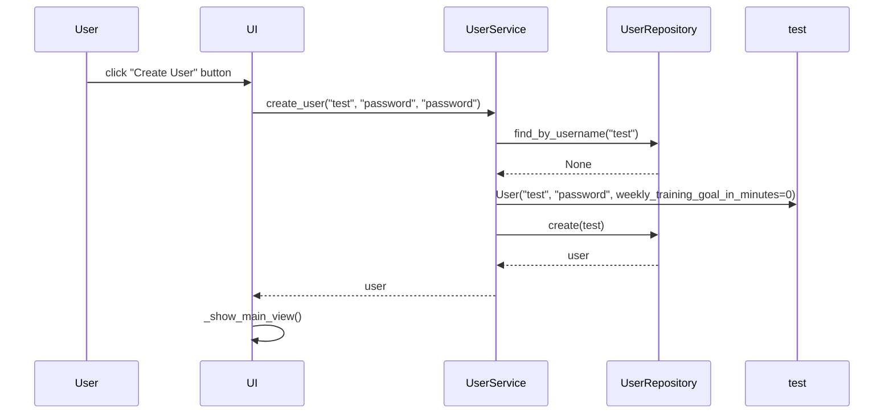
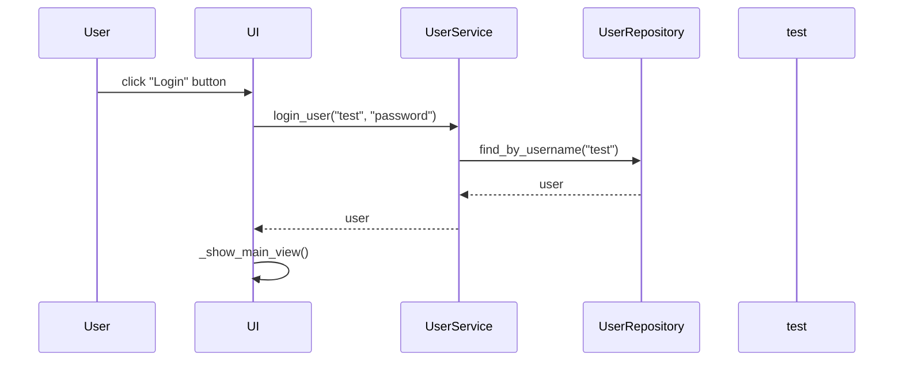
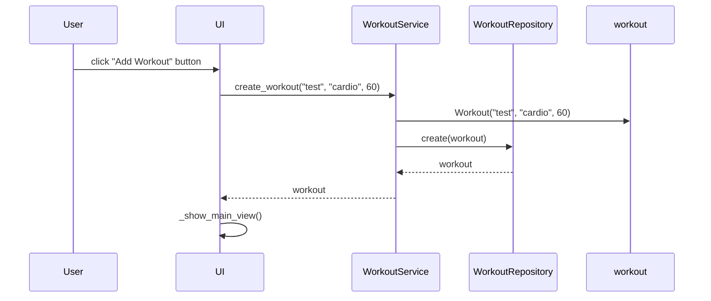

# Arkkitehtuurikuvaus

## Rakenne

Sovelluksen rakenne koostuu kolmesta eri kerroksesta, joilla jokaisella on oma vastuunsa. Näistä ui-pakkaus vastaa käyttöliittymästä, services-pakkaus sovelluslogiikasta ja repositories-pakkaus tiedon pysyväistallentamisesta tietokantaan.

## Käyttöliittymä

Sovelluksen käyttöliittymä sisältää seuraavat näkymät:

- Kirjautuminen
- Käyttäjän luonti
- Päänäkymä
- Treenitavoitteen muokkaus
- Viikon treenihistoria
- Treenin luonti
- Treenin muokkaus
- Treenin poiston vahvistus

Käyttöliittymä on eristetty muusta sovelluslogiikasta ja sen tehtävänä on kutsua UserService- ja WorkoutService-luokkien metodeja riippuen käyttäjän toiminnasta sovelluksessa.

## Sovelluslogiikka

Alla olevassa pakkauskaavioissa on kuvattu sovelluksen eri osien suhteet toisiinsa.

Sovelluslogiikan kannalta olennaisimmat luokat ovat UserService ja WorkoutService, jotka vastaavat sovelluksen toiminnallisuuksista.
Sovelluksen looginen tietomalli muodostuu User- ja Workout-luokista, jotka kuvaavat käyttäjiä ja niiden treenejä. Käyttäjä voi lisätä useita treenejä, mutta jokainen treeni kuuluu vain yhdelle käyttäjälle.

## Tietojen pysyväistallennus

Pakkauksen repositories luokkien UserRepository ja WorkoutRepository tehtävinä on vastata tietojen tallentamisesta.
Tietojen tallentaminen tapahtuu kummassakin tapauksessa hyödyntämällä SQLite-tietokantaa. Käyttäjätiedot tallennetaan tietokanta tauluun `users` ja treenitiedot tauluun `workouts`.

## Päätoiminnallisuudet

Alla on esitelty sovelluksen päätoiminnallisuuksia sekvenssikaavioiden avulla.

### Käyttäjän luonti

### Käyttäjän kirjautuminen

### Uuden treenin luonti

### Muut toiminnallisuudet

Sovelluksen muut toiminnallisuudet, kuten treenitavoitteen asetus sekä treenin muokkaus ja poisto, toimivat samalla tavalla. Käyttöliittymä kutsuu sovelluslogiikan metodeja, jotka puolestaan tekevät operaatioita tietokantaan ja palauttavat näiden operaatioiden tulokset käyttöliittymään, joka tarvittaessa päivittää näkymän käyttäjälle.
