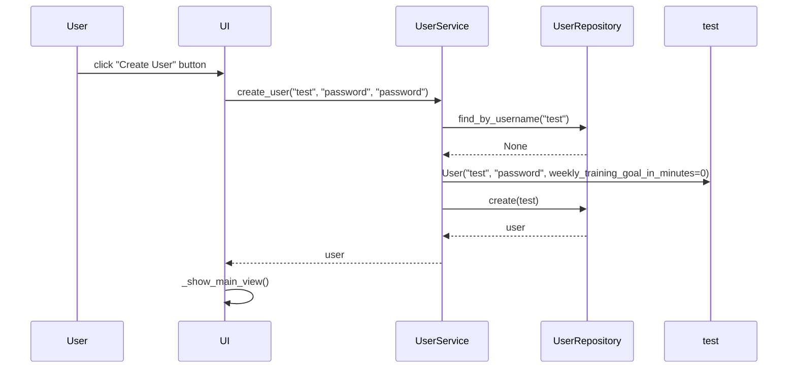

## Sovelluksen tämän hetkinen pakkauskaavio:

## Sekvenssikaaviot

### Käyttäjän luonti

```mermaid
sequenceDiagram
  participant User
  participant UI
  participant UserService
  participant UserRepository
  participant test
  User->>UI: click "Create User" button
  UI->>UserService: create_user("test", "password", "password")
  UserService->>UserRepository: find_by_username("test")
  UserRepository-->>UserService: None
  UserService->>test: User("test", "password", weekly_training_goal_in_minutes=0)
  UserService->>UserRepository: create(test)
  UserRepository-->>UserService: user
  UserService-->>UI: user
  UI->>UI: _show_main_view()
```
