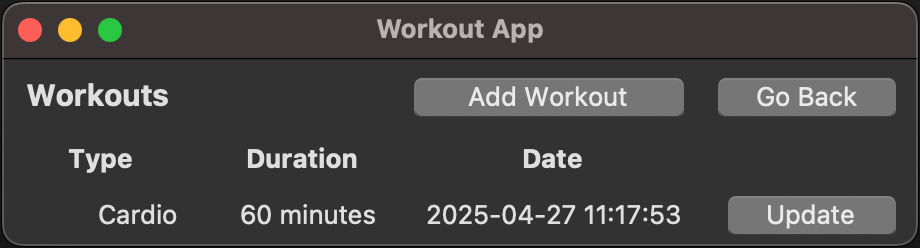

# Käyttöohje

## Sovelluksen konfigurointi

Jos haluat muuttaa sovelluksen tietokanta-tiedoston oletusnimeä (database.sqlite), voit tehdä sen luomalla .env-tiedoston ja korvaamalla sen haluamallasi nimellä:

    DATABASE_FILENAME=database.sqlite

## Sovelluksen käynnistäminen

1.  Siirry sovelluksen hakemistoon:

        cd python-workout-app

2.  Asenna sovelluksen vaatimat riippuvuudet:

        poetry install

3.  Alusta sovelluksen käyttämä tietokanta:

        poetry run invoke build

4.  Käynnistä sovellus:

        poetry run invoke start

## Kirjautuminen

Sovellus käynnistyy kirjautumisnäkymään:

Kirjautumisnäkymässä voit syöttää käyttäjätunnuksesi ja salasanasi ja painamalla "Login" painiketta, kirjaudut sisään sovellukseen.

## Uuden käyttäjän luominen

Uuden käyttäjän luominen onnistuu painamalla "Create User" painiketta kirjautumisnäkymässä. Tällöin sovellus siirtyy uuden käyttäjän luonti näkymään, jossa voit syöttää haluamsi käyttäjätunnuksen ja salasanan sekä vahvistaa salasanan. Kun olet syöttänyt tiedot, voit luoda uuden käyttäjän painamalla "Create" painiketta. Jos luonti onnistuu, sovellus kirjaa sinut automaattisesti sisään. Voit perua luonnin painamalla "Go Back" painiketta.

## Sovelluksen päänäkymä

Sovelluksen päänäkymässä voit asettaa viikottaisen treenitavoitteesi ja nähdä kuinka lähellä olet tavoitettasi. Sen lisäksi voit siirtyä tarkastelemaan käynnissä olevan viikon treenihistoriaa. Sovelluksen päänäkymässä voit myös kirjautua ulos sovelluksesta painamalla "Logout" painiketta.

## Viikottaisen treenitavoitteen muokkaaminen

Viikottaista treenitavoitetta voi muuttaa päänäkymässä painamalla "Update" painiketta, jolloin sovellus siirtyy sen muokkausnäkymään. Tavoitteen muuttaminen onnistuu syöttämällä haluamasi tavoite "New Workout Goal" kenttään ja painamalla "Update" painiketta. Tällöin sovellus päivittää treenitavoitteesi ja siirtyy takaisin sovelluksen päänäkymään. Voit myös perua muutoksen painamalla "Cancel" painiketta.

## Viikon treenien tarkastelu

Viikon treenihistorian tarkastelu onnistuu painamalla "Workouts" painiketta sovelluksen päänäkymässä. Tällöin sovellus siirtyy treenien tarkastelu näkymään, jossa voit nähdä kaikki viikon treenit, lisätä uuden treenin ja muokata olemassa olevia treenejä. Painamalla "Go Back" painiketta, sovellus siirtyy takaisin sovelluksen päänäkymään.

## Uuden treenin luominen

Uuden treenin luominen onnistuu painamalla "Add Workout" painiketta treenien tarkastelu näkymässä. Tällöin sovellus siirtyy uuden treenin luonti näkymään, jossa voit syöttää treenin nimen ja keston. Kun olet syöttänyt tiedot, voit luoda uuden treenin painamalla "Create" painiketta. Jos luonti onnistuu, sovellus siirtyy takaisin treenien tarkastelu näkymään. Voit myös perua muutoksen painamalla "Cancel" painiketta.

## Treenin muokkaaminen ja poistaminen

Treenin muokkaaminen onnistuu painamalla "Update" painiketta yksittäisen treenin kohdalta treenien tarkastelu näkymässä. Tällöin sovellus siirtyy treenin muokkaus näkymään, jossa voit muuttaa treenin tietoja. Kun olet syöttänyt tiedot, voit päivittää treenin tiedot painamalla "Update" painiketta. Olemassa olevan treenin tiedot voi poistaa painamalla "Delete" painiketta. Jos päivitys onnistuu, sovellus siirtyy takaisin treenien tarkastelu näkymään. Voit myös perua muutokset painamalla "Cancel" painiketta.

## Treenin poiston vahvistaminen

Painamalla "Delete" painiketta treenin muokkaus näkymässä, sovellus kysyy vielä vahvistusta treenin poistamiselle. Poisto tapahtuu painamalla "Delete" painiketta. Voit myös perua poiston painamalla "Cancel" painiketta.
