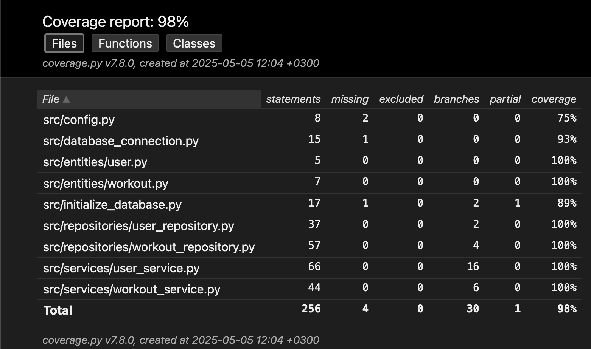

# Testausdokumentti

Sovelluksen testaus koostuu automaattisista yksikkö- ja integraatiotesteistä, jotka on toteutettu käyttäen `unittest`-kirjastoa ja ne sijaitsevat `src/tests`-hakemistossa. Tämän lisäksi sovellusta on testattu järjestelmätasolla manuaalisesti käyttöliittymästä käsin.

## Yksikkö- ja integraatiotestaus

### Alkutoimet

Tietokannan testejä varten voi luoda lisäämällä `env.test`-tiedoston juurihakemistoon, joka sisältää testitietokannan nimen.

    DATABASE_FILENAME=test-database.sqlite

**Muussa tapauksessa testit käyttävät sovelluksen tietokantaa, mikä saattaa johtaa tietojen häviämiseen!**

### Repositorio-luokat

Sovelluksen UserRepository ja WorkoutRepository-luokkien testit sijaitsevat `src/tests/repositories`-hakemistossa. Näistä TestUserRepository-luokka testaa UserRepository-luokan toiminnallisuuksia ja TestWorkoutRepository-luokka testaa WorkoutRepository-luokan toiminnallisuuksia.

### Sovelluslogiikka

Sovelluksen sovelluslogiikasta vastaavien UserService- ja WorkoutService-luokkien testit sijaitsevat `src/tests/services`-hakemistossa. Näistä TestUserService-luokka testaa UserService-luokan toiminnallisuuksia ja TestWorkoutService-luokka testaa WorkoutService-luokan toiminnallisuuksia.

### Testikattavuus

Sovelluksen testikattavuus on tarkastettu `coverage`-kirjastolla. Testien haarautumakattavuus on 98%, kun käyttöliittymän sisältävää koodia ei oteta huomioon.

## Järjestelmätestaus

Sovellusta on testattu manuaalisesti suorittamalla kaikki sovelluksen toiminnallisuudet käyttöliittymästä käsin. Tämä pitää sisällään myös virheelliset ja tyhjät syötteet. Tätä ennen on sovellus on käynnistetty [käyttöohjeessa](./kayttoohje.md) mainittujen ohjeiden mukaan. Käyttöjärjestelmät joilla sovellusta on testattu ovat macOS Ventura ja Cubbli 24 (Helsingin Yliopiston linux-jakelu).
